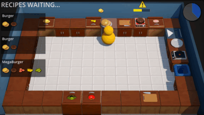
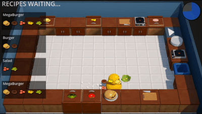
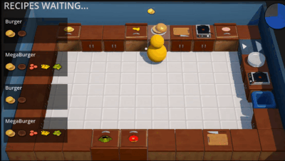
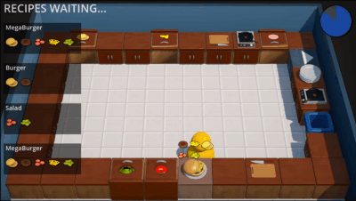
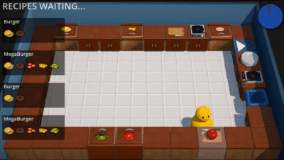

# Kitchen Chaos - Godot Version

## Introduction
This game is the recreation of Code Monkey's Kitchen Chaos Unity tutorial in Godot 4.2. I created this project to make myself familiar with the engine. I tried to implement everything in Godot as closely as possible to how it was made in Unity; however, it was necessary to deviate from the original from time to time, mostly in the UI and because GDScript does not support interfaces.

## Preview

## Acknowledgments
- The original tutorial and the creators channle can be found in the links below:
- [Unity Tutorial for Kitchen Chaos](https://youtu.be/AmGSEH7QcDg?si=kNedQswsWct8rkBC)
- [Code Monkey YouTube Channel](https://www.youtube.com/@CodeMonkeyUnity)

## Getting Started
These instructions will get you a copy of the project up and running on your local machine for development and testing purposes.

### Prerequisites
- [Godot 4.2](https://godotengine.org/download)

### Installation
1. Clone the repository:
git clone https://github.com/yourusername/kitchen-chaos-godot.git
 
2. Open Godot and import the project:
- Launch Godot.
- Select "Import" from the project manager.
- Navigate to the cloned project folder.
- Select the `project.godot` file and click "Import & Edit."

### Running the Game
- After importing, click 'Play' to start the game within the Godot editor, or export the game to your desired platform by following Godot's exporting guide.

## License
This project is licensed under the MIT License - see the [LICENSE.md](LICENSE.md) file for details.

## P.S.
Any constructive feedback/criticism is appreciated. 
